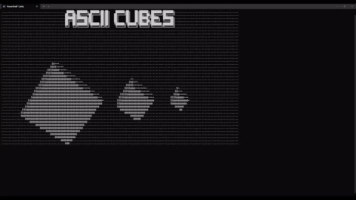

# Exercise - ASCII 3D Cubes Rendered

A small C program that renders three rotating 3D cubes directly in the terminal using ASCII characters. It implements basic 3D rotation, perspective projection, and z-buffering to create a simple animated console graphics effect.

## Technologies
* C